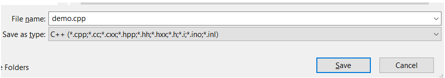
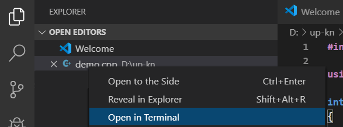
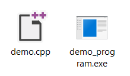

## Увод в програмирането
### Записки от практикум 1

Средата за разработка, която ще използваме по време на семинарите и практикумите е **Visual Studio Code**, като програмите ще компилираме през конзолата чрез стандартните команди (за които ще говорим по-късно).
##### Инсталиране на компилатор
Компилаторът най-общо казано е програма, която преобразува кода, който сме написали на някакъв програмен език (в случая С++) до изпълнима програма или по-точно до машинен код, който процесорът разбира. Съответно за да можем да изпълним програмите, които ще пишем по време на курса, ще имаме нужда да инсталираме компилатор на нашите машини. Компилатор може да си изтеглите от следния линк [MinGW](
http://www.mingw-w64.org/doku.php).
##### Създаване на С++ файл
При създаване на нов файл във Visual Studio Code (накратко VSCode), той е с разширение **.txt**. Нов файл създваме като изберем `File -> New File` или чрез просто `Ctrl + N`.  За да разбира текстовият редактор и изобщо операционната система, че текстът, който пишем е С++ код, е нужно файлът, в който пишем да е с разширение **.cpp**. Най-лесният начин, по който това може да стане е като изберем  и зададем разширение .cpp.  

##### Първа програма на С++
Нека първата програма, която напишем е изписване на Hello World! на конзолата. Целта на това е да преминем през стъпките на компилацията и изпълнението. Първият ред от програмата е `#include <iostream>`, който както си говорихме вмъква библиотеката, която съдържа операциите за вход и изход. По време на курса ще говорим и за други библиотеки, но за момента този е достатъчна. `using namespace std;` засега няма да коментираме какво точно прави, по-нататък в курса ще говорим повече. В блока `int main() {}` се намира отправната точка на програмата, тоест от там започва нейното изпълнение. `cout << ` може да приемем, че означава "изход към конзолата".
```c++
#include <iostream>

using namespace std;

int main() 
{
  cout << "Hello world!";
  
  return 0;
}
```   
   
##### Компилация
За да компилираме програмата трябва имаме отворена конзола: ако става въпрос за Windows, това може да бъде *Command Prompt*, но по-удобно е да използваме терминала във VSCode. Това става по следния начин: избираме `Terminal -> New Terminal`. **Задължително е текущата работна директория на терминала да е тази, в която се намира файлът, върху който работим**, единият начин, по който това може да стане, е като намерим файла в т.нар. Exploler, натиснем дясно копче и изберем Open in Terminal:  
  
Друг начин може да бъде да намерим файла във файловата система на компютъра си и да компираме пътя до съответната папка, в която той се намира и след това да изпълним командата `cd` в терминала. 
Например, ако файлът ви се намира в папката *D:\up\week1*, то пишем следното в терминала `cd D:\up\week1`.

След като вече сме сигурни, че работната ни директория е правилната, можем да компилираме програмата си. Това става по следната схема: `g++ име_на_файл.cpp -о име_на_програма`, частта от `-o` нататък може да бъде изпусната, в такъв случай програмата ни ще се казва *a.exe*. Пример: файлът, който по-горе писахме, при мен се казва *dema.cpp*, искам да го компилирам до програма, която се казва *demo_program*, за целта пиша в терминала `g++ demo.cpp -o demo_program`. Ако компилацията е минала успешно (без грешки в кода), в папката, в която работим трябва да е създаден нов файл *demo_program.exe*.  


##### Изпълнение на програмата
Програмата може да се изпълни по два начина: 
1. През терминала, като се спазва схемата `./има_на_програма`, за по-горния случай това би било `./demo_program`.
2. Чрез изпълняване на .exe файла, който се намира в работната папка, чрез double-click например. Тогава за всяко ново пускане се отваря нова конзола.